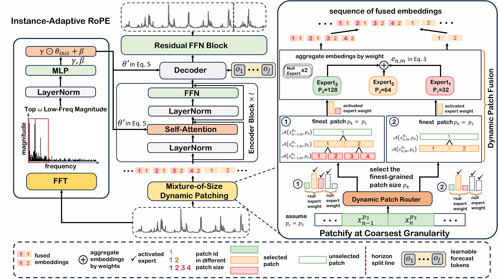

# Kairos: Towards Adaptive and Generalizable Time Series Foundation Models

[](https://arxiv.org/abs/2509.25826)
[](https://huggingface.co/mldi-lab/Kairos_50m)
[](https://foundation-model-research.github.io/Kairos/)


## 📅 News
- **30 Sep 2025**: 📅 Kairos [paper](https://arxiv.org/abs/2509.25826) and inference code released.
## 🌟 Introduction

**Kairos** is a flexible time series foundation model designed to handle the dynamic and heterogeneous nature of real-world time series data. Unlike existing models that rely on rigid, non-adaptive processing pipelines, Kairos introduces two key innovations:

- **🔀 Mixture-of-Size Dynamic Patching (MoS-DP)**: Adaptively selects tokenization granularity based on local information density, allowing the model to zoom in on fine-grained details during critical periods and abstract efficiently during stable phases.

- **🔄 Instance-adaptive Rotary Position Embedding (IARoPE)**: Tailors positional encodings to the unique temporal characteristics of each time series instance, enabling better modeling of diverse periodicities and trends across different domains.

Trained on the large-scale Predictability-Stratified Time Series (PreSTS) corpus comprising over 300 billion time points, Kairos achieves superior zero-shot forecasting performance with significantly fewer parameters compared to existing methods on both GIFT-Eval and Time-Series-Library benchmarks.
## 📊 Method Overview

Overview of the Kairos architecture, highlighting Mixture-of-Size Dynamic Patching (MoS-DP) and Instance-adaptive Rotary Position Embedding (IARoPE).

<p align="center">
  
</p>

## 📊 Evaluation

Kairos achieves superior performance with fewer parameters on two common zero-shot benchmarks. 

- ### [GIFT-Eval](https://huggingface.co/spaces/Salesforce/GIFT-Eval)

<p align="center">
  
</p>

- ### [Time-Series-Library (TSLib)](https://github.com/thuml/Time-Series-Library)

<p align="center">
  
</p>

## 💻 Usage

### Prerequisites

Before running the forecasting pipeline, you need to install the required dependencies. Use the following command to install all necessary packages:

```bash
pip install -r requirements.txt
```

### Model Setup

Our model weights are available on Hugging Face. You can access them at the following links:
- **50M:** [https://huggingface.co/mldi-lab/Kairos_50m](https://huggingface.co/mldi-lab/Kairos_50m)
- **23M:** [https://huggingface.co/mldi-lab/Kairos_23m](https://huggingface.co/mldi-lab/Kairos_23m)
- **10M:** [https://huggingface.co/mldi-lab/Kairos_10m](https://huggingface.co/mldi-lab/Kairos_10m)

### Quickstart

The `datasets` folder contains a specific sequence segment from the `ETTh1` dataset, which is a component of the zero-shot test dataset.

You can run our forecasting demo using the `quickstart_zero_shot.ipynb` notebook.

Alternatively, you can use the following Python code snippet for a quick start to load the Kairos model and generate a forecast:
```python
import torch
from tsfm.model.kairos import AutoModel

# load model
model = AutoModel.from_pretrained(
    "mldi-lab/Kairos_50m", trust_remote_code=True
)

# forecasting configurations
batch_size, context_length, prediction_length = 1, 2048, 96
seqs = torch.randn(batch_size, context_length)

prediction_length = 96
forecast = model(
    past_target=seqs.clone().detach().float(),
    prediction_length=prediction_length,
    generation=True,
    preserve_positivity=True,
    average_with_flipped_input=True
)

# extract the prediction results
forecast = forecast["prediction_outputs"]
print(forecast.shape)
```

## 🤝 Acknowledgements

This repository includes code adapted from [Chronos: Learning the Language of Time Series](https://github.com/amazon-science/chronos-forecasting). We thank the authors for their excellent work and open-source contributions.
We also extend our gratitude to the creators of the following datasets used in our work:
- [LOTSA Data](https://huggingface.co/datasets/Salesforce/lotsa_data)
- [Chronos Datasets](https://huggingface.co/datasets/autogluon/chronos_datasets)

## ⚖️ License

This project is licensed under the Apache License 2.0 - see the [LICENSE](LICENSE) file for details.

## 💬 Contact
We welcome any questions, feedback, or potential collaborations. You can reach us at:

- **Kun Feng**: [fengkun2025@shanghaitech.edu.cn](mailto:fengkun2025@shanghaitech.edu.cn)
- **Shaocheng Lan**: [lanshch2024@shanghaitech.edu.cn](mailto:lanshch2024@shanghaitech.edu.cn)
- **Yuchen Fang**: [yuchen.fyc@antgroup.com](mailto:yuchen.fyc@antgroup.com)


## 📝 Citation

If you find Kairos models useful for your research, please consider citing the associated [paper](https://arxiv.org/abs/2509.25826):
```

```