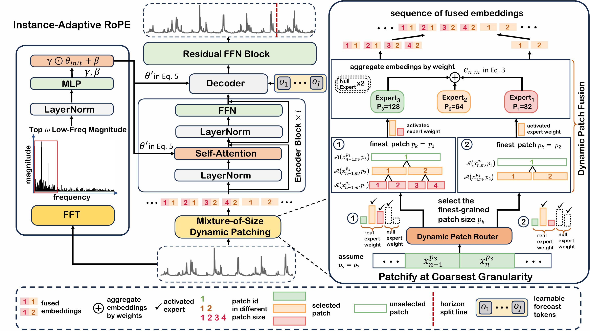

# Kairos: Towards Adaptive and Generalizable Time Series Foundation Models

[](https://arxiv.org/abs/2509.25826)
[](https://huggingface.co/mldi-lab/Kairos_50m)
[](https://huggingface.co/mldi-lab/Kairos_23m)
[](https://huggingface.co/mldi-lab/Kairos_10m)
[](https://foundation-model-research.github.io/Kairos/)

## 📅 News
- **16 Feb 2026**: 📅 Updated Kairos [paper (v2)](https://arxiv.org/abs/2509.25826) released.
- **06 Oct 2025**: ✨ Kairos is now on the [GIFT-Eval Leaderboard](https://huggingface.co/spaces/Salesforce/GIFT-Eval).
- **30 Sep 2025**: 📅 Kairos [paper](https://arxiv.org/abs/2509.25826) and inference code released.
## 🌟 Introduction

**Kairos** is a flexible and parameter-efficient Time Series Foundation Model (TSFM) designed to handle the dynamic and heterogeneous nature of real-world time series data. Unlike existing models that rely on rigid, non-adaptive processing pipelines and massive parameterization, Kairos decouples temporal heterogeneity from model capacity through three key architectural innovations:

- **🔀 Mixture-of-Size Encoder**: Adaptively tokenizes time series at multiple granularities based on local information density. It utilizes a Top-K granularity router with null experts to efficiently model diverse temporal patterns.

- **🔄 Heterogeneity-Aware Transformer**: Incorporates **Dynamic Rotary Position Embedding (DRoPE)**, a granularity-aware positional encoding that modulates temporal scales using instance-level spectral features. It adapts to the varying physical durations of dynamic patches, enabling robust modeling of diverse temporal dependencies.

- **⏩ Multi-Patch Decoder**: Employs learnable forecast tokens to predict multiple future patches in parallel, mitigating cumulative errors in autoregressive generation and offering flexibility for variable-length prediction horizons.

Trained on the large-scale **Predictability-Stratified Time Series (PreSTS)** corpus comprising over 300 billion time points, Kairos achieves superior zero-shot forecasting performance with significantly fewer parameters compared to existing methods on both GIFT-Eval and Time-Series-Library benchmarks.

## ⚙️ Method Overview

Overview of the Kairos architecture, highlighting the Mixture-of-Size Encoder, Heterogeneity-Aware Transformer with DRoPE, and the Multi-Patch Decoder.

<p align="center">
  
</p>

## 📊 Evaluation

Kairos achieves superior performance with fewer parameters on two common zero-shot benchmarks. 

- ### [GIFT-Eval](https://huggingface.co/spaces/Salesforce/GIFT-Eval)

<p align="center">
  
</p>

- ### [Time-Series-Library (TSLib)](https://github.com/thuml/Time-Series-Library)

<p align="center">
  
</p>

## 💻 Usage

### Prerequisites

Choose one of the following methods to set up the environment:

**Option 1: Install from Source (Recommended)**
Best for users who want to use the library directly. This ensures `tsfm` is globally accessible in your environment and resolves path issues automatically.

```bash
pip install git+https://github.com/foundation-model-research/Kairos
```

**Option 2: Local Setup**
Best for running demos or modifying the code locally.

```bash
git clone https://github.com/foundation-model-research/Kairos.git
cd Kairos
pip install -r requirements.txt
```

> **Note:** If you choose Option 2, please ensure the project root is added to your `PYTHONPATH` or use `sys.path.append` in your scripts to avoid `ModuleNotFoundError`.

### Model Setup

Our model weights are available on Hugging Face. You can access them at the following links:
- **50M:** [https://huggingface.co/mldi-lab/Kairos_50m](https://huggingface.co/mldi-lab/Kairos_50m)
- **23M:** [https://huggingface.co/mldi-lab/Kairos_23m](https://huggingface.co/mldi-lab/Kairos_23m)
- **10M:** [https://huggingface.co/mldi-lab/Kairos_10m](https://huggingface.co/mldi-lab/Kairos_10m)

### Quickstart

The `datasets` folder contains a specific sequence segment from the `ETTh1` dataset, which is a component of the zero-shot test dataset.

You can run our forecasting demo using the `quickstart_zero_shot.ipynb` notebook.

Alternatively, you can use the following Python code snippet for a quick start to load the Kairos model and generate a forecast:
```python
import torch
from tsfm.model.kairos import AutoModel

# load model
model = AutoModel.from_pretrained(
    "mldi-lab/Kairos_50m", trust_remote_code=True
)

# forecasting configurations
batch_size, context_length, prediction_length = 1, 2048, 96
seqs = torch.randn(batch_size, context_length)

prediction_length = 96
forecast = model(
    past_target=seqs.clone().detach().float(),
    prediction_length=prediction_length,
    generation=True,
    preserve_positivity=True,
    average_with_flipped_input=True
)

# extract the prediction results
forecast = forecast["prediction_outputs"]
print(forecast.shape)
```

## 🤝 Acknowledgements

This repository includes code adapted from [Chronos: Learning the Language of Time Series](https://github.com/amazon-science/chronos-forecasting). We thank the authors for their excellent work and open-source contributions.
We also extend our gratitude to the creators of the following datasets used in our work:
- [LOTSA Data](https://huggingface.co/datasets/Salesforce/lotsa_data)
- [Chronos Datasets](https://huggingface.co/datasets/autogluon/chronos_datasets)

## ⚖️ License

This project is licensed under the Apache License 2.0 - see the [LICENSE](LICENSE) file for details.

## 💬 Contact
We welcome any questions, feedback, or potential collaborations. You can reach us at:

- **Kun Feng**: [fengkun2025@shanghaitech.edu.cn](mailto:fengkun2025@shanghaitech.edu.cn)
- **Shaocheng Lan**: [lanshch2024@shanghaitech.edu.cn](mailto:lanshch2024@shanghaitech.edu.cn)
- **Yuchen Fang**: [yuchen.fyc@antgroup.com](mailto:yuchen.fyc@antgroup.com)


## 📝 Citation

If you find Kairos models useful for your research, please consider citing the associated [paper](https://arxiv.org/abs/2509.25826):
```
@article{feng2025kairos,
  title={Kairos: Towards Adaptive and Generalizable Time Series Foundation Models},
  author={Feng, Kun and Lan, Shaocheng and Fang, Yuchen and He, Wenchao and Ma, Lintao and Lu, Xingyu and Ren, Kan},
  journal={arXiv preprint arXiv:2509.25826},
  year={2025}
}
```